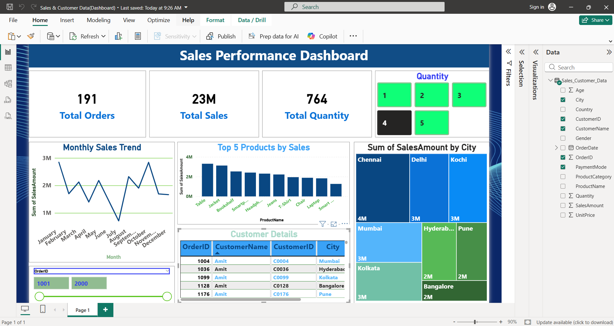

# 📊 Sales Performance Dashboard (Power BI)

## 🔍 Project Overview

This project presents an interactive Sales Performance Dashboard built using Power BI.  
The dashboard analyzes sales, customer, and product data to generate meaningful business insights and support data-driven decision-making.

The objective of this project is to demonstrate practical skills in data modeling, DAX calculations, KPI design, and professional dashboard development.

---

## 📁 Dataset Information

The dataset contains structured sales data with the following fields:

- Order ID  
- Order Date  
- Customer ID  
- Customer Name  
- Product Category  
- Product Name  
- City  
- Quantity  
- Sales Amount  

The dataset used for this project is available for the above "Sales_Customer_1000_Records".

---

## 📈 Key KPIs & Metrics

The dashboard includes the following business metrics:

- Total Orders  
- Total Sales Revenue  
- Total Quantity Sold  
- Monthly Sales Trend  
- Top 5 Products by Sales  
- City-wise Sales Distribution  

DAX functions used include:
- SUM
- COUNT
- DIVIDE
- CALCULATE

---

## 🛠 Tools & Technologies Used

- Power BI Desktop  
- DAX (Data Analysis Expressions)  
- Microsoft Excel  
- Data Visualization Best Practices  

---

## 📊 Dashboard Features

- Interactive slicers for filtering data  
- Dynamic visual updates based on user selection  
- Monthly aggregated sales trend  
- Top-performing product analysis  
- City-wise revenue comparison  

---

## 📌 Business Insights

- Identified high-performing products contributing to overall revenue  
- Observed monthly sales trends and fluctuations  
- Compared revenue contribution across different cities  
- Analyzed order volume distribution  

---

## 🖼 Dashboard Preview

---

## 🎯 Learning Outcomes

Through this project, I improved my understanding of:

- Designing clean and professional dashboards  
- Creating meaningful business KPIs  
- Writing DAX measures for calculated metrics  
- Structuring projects for GitHub portfolio presentation  

---

## 🚀 Future Enhancements

- Implement YTD / MTD / YoY time intelligence analysis  
- Add growth percentage indicators with trend icons  
- Improve data modeling using star schema design  
- Create an executive summary page  

---

## 👨‍💻 Author
**Patri Chaitanya Sri Lalitha Sai**  
Aspiring Data Analyst | Power BI & Data Visualization Enthusiast  

📌 Passionate about transforming raw data into meaningful business insights through interactive dashboards.

🔗 LinkedIn: [linkedin.com/in/patri-chaitanya-sri-lalitha-sai-2a53bb278](https://www.linkedin.com/in/patri-chaitanya-sri-lalitha-sai-2a53bb278/)  
🔗 GitHub: [github.com/patri-chaitanya](https://github.com/patri-chaitanya)
